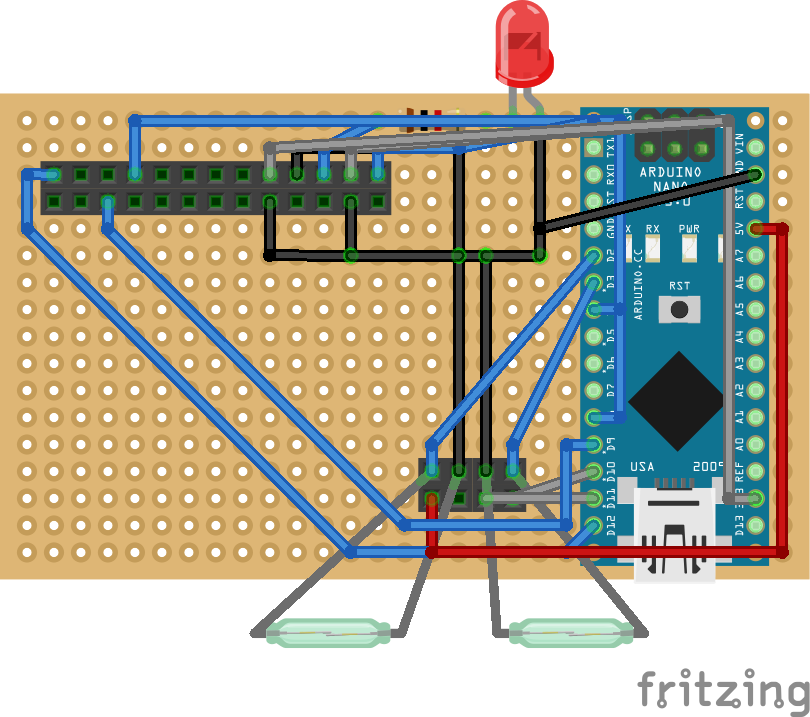

:Author: Reiji-N
:Email: nishiyama.reiji@gmail.com
:Date: 24/02/2018
:Revision: version#
:License: Public Domain
:Project: Mailbox_sender

= Project: {Project}

This arduino project is a part of rny-1.

Capture an image of the inside of mailbox and send it to the server side when letters are posted or picked into/from the mailbox.

== Step 1: Installation

Open this file in your arduino editor

== Step 2: Assemble the circuit

See the layout image and BOM.

.Layout image

== Step 3: Load the code

Upload the code contained in this sketch on to your board

=== Folder structure

 Mailbox_sender
  ├── Mailbox_sender.ino
  ├── Mailbox_sender_layout.png
  └── ReadMe.adoc

=== License
This project is released under a {License} License.

=== BOM

|===
| ID | Part name      | Part number | Quantity
| R1 | 1k Resistor   |             | 1       
| L1 | Red LED        |             | 1        
| A1 | Arduino Nano   |             | 1        
| S1 | Reed Switch    |             | 2
| T1 | IM920          |             | 1        
| M1 | Link Sprite Jpeg color camera    |             | 1        
|===

